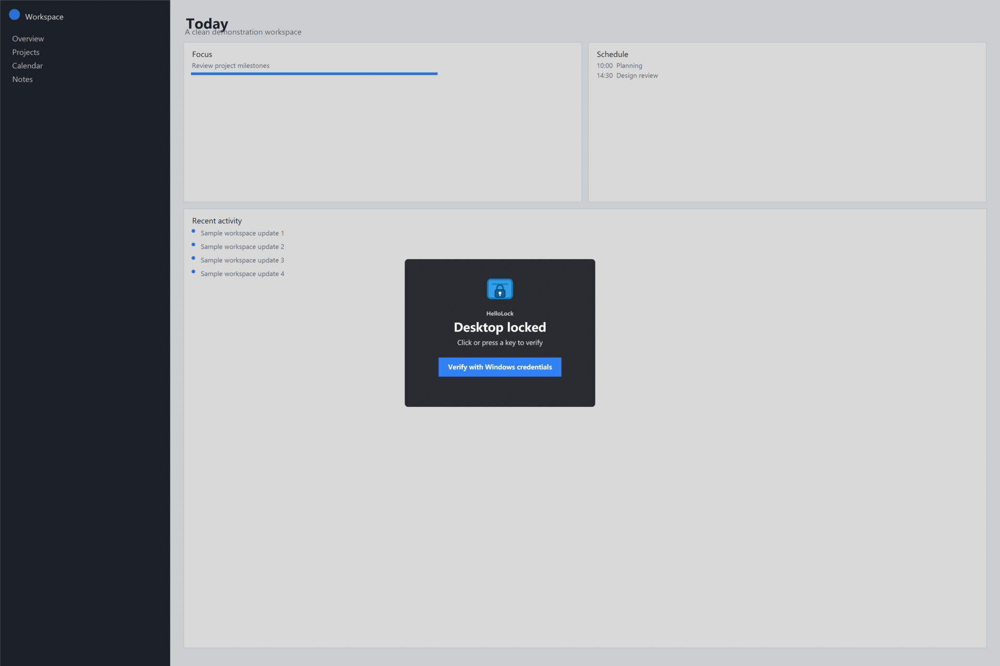

<p align="center">
  
</p>

<h1 align="center">HelloLock</h1>

<p align="center">
  保持桌面可见，使用 Windows 原生凭据验证的透明应用级锁定工具。
</p>

<p align="center">
  <a href="README.md">English</a>
</p>

HelloLock 是 Windows 上的透明应用级锁定工具。它保持桌面内容可见，拦截常规键盘
输入及对覆盖桌面的指针操作，并通过 Windows 凭据界面验证当前用户后解锁。

支持 Windows Hello PIN、指纹、人脸及系统为当前用户提供的其他 Credential Provider。

> [!IMPORTANT]
> HelloLock 不是 Windows 安全边界，也不能代替真正的 Windows 锁屏。需要抵抗管理员、
> SYSTEM 进程、远程管理、调试注入、强制注销、重启或程序崩溃时，请使用系统锁屏。



## 功能

- 覆盖整个虚拟桌面的透明置顶遮罩
- 使用 Windows Hello 验证，不读取或保存 PIN
- 锁定期间拦截常见键盘切换快捷键
- 通过全屏覆盖窗阻止鼠标点击；没有安装全局 mouse / touch hook
- 支持标准 Windows 屏保参数 `/s`、`/c`、`/p`
- 登录后常驻托盘，左键单击立即锁定
- 托盘和锁屏分别使用 per-user 单实例约束
- 无需管理员权限或 Windows service，可恢复原屏保配置

## 安装

Releases 提供两种包：

- **self-contained**（推荐）：无需另装 .NET，压缩后约 73 MB；
- **framework-dependent**：压缩后约 6 MB，但需要预先安装
  [.NET 8 Desktop Runtime x64](https://dotnet.microsoft.com/download/dotnet/8.0)。

从 [Releases](https://github.com/iFwu/hello-lock/releases) 下载对应 zip，解压后运行：

```powershell
powershell -ExecutionPolicy Bypass -File scripts\install.ps1 `
  -PublishedDirectory publish `
  -TimeoutSeconds 1800 `
  -AllowApplicationLevelUnlock
```

安装脚本会部署到 `%LOCALAPPDATA%\Programs\HelloLock`，注册 30 分钟屏保，关闭
屏保退出后额外叠加的 Windows 登录，并创建当前用户的 `HelloLock Tray` 登录任务。
`Win+L`、睡眠和合盖后的系统锁屏不会被修改。

`-AllowApplicationLevelUnlock` 用于明确确认安装器会设置 `ScreenSaverIsSecure=0`，由
HelloLock 自己负责凭据验证；若程序崩溃或被高权限进程终止，系统不会像 Winlogon
secure desktop 那样继续保护桌面。

恢复原配置、移除托盘自启并删除安装文件：

```powershell
powershell -ExecutionPolicy Bypass -File scripts\uninstall.ps1
```

卸载默认保留诊断日志。使用 `-RemoveLogs` 可一并删除日志；排查卸载问题时可用
`-KeepFiles` 保留安装文件。

## 使用

- 左键单击托盘盾牌图标立即锁定。
- 右键菜单提供“立即锁定”和“退出托盘”。
- 直接运行 `HelloLock.exe` 或 `HelloLock.scr /s` 也会锁定。
- 按任意键或点击遮罩后，通过 Windows Hello 解锁。

诊断日志位于 `%LOCALAPPDATA%\HelloLock\authentication.log`，只包含结果码和 buffer
大小，不记录凭据内容。

## 构建

```powershell
dotnet restore src\HelloLock.csproj
dotnet build src\HelloLock.csproj -c Release --no-restore
dotnet publish src\HelloLock.csproj -c Release -r win-x64 `
  --self-contained false -o artifacts\framework-dependent

dotnet publish src\HelloLock.csproj -c Release -r win-x64 `
  --self-contained true -o artifacts\self-contained
```

两种包都使用多文件发布。WPF single-file bundling 曾在一台实机上触发 native DLL
load failure，因此没有启用单文件发布；WPF/WinForms 也不支持 trimming 或 NativeAOT。

## 安全边界

HelloLock 能有效阻止普通现场人员操作桌面。鼠标拦截依赖覆盖窗自身的 hit-testing，
不是全局 mouse / touch hook；Windows 放在覆盖层之上的 system UI 或更高 window band
仍可能收到鼠标、触摸或手写笔输入。低级键盘 hook 会继续阻止常规键盘输入，除非可信
凭据窗口处于前台。

在已测试的 Windows 上，即使通过 `Ctrl+Alt+Del` 打开任务管理器，普通任务管理器仍
位于覆盖层下方，不能直接作为键鼠绕过路径；这属于实测行为，不是对所有 Windows
版本与配置的安全保证。

但 HelloLock 运行在普通用户桌面，不是 Winlogon secure desktop，也没有防篡改能力。
管理员或 SYSTEM 进程、远程管理、调试注入、强制注销、重启或程序崩溃都可能解除保护。
需要抵抗主动攻击时，请使用 Windows 系统锁屏。

认证链、实现说明和 Chromium 参考见英文 [README](README.md)。安全问题报告方式见
[SECURITY.md](SECURITY.md)。

## License

[MIT](LICENSE)
